# Тема 4. Функции и стандартные модули/библиотеки
Отчет по Теме #4 выполнил(а):
- Новицкий Тимофей Дмитриевич
- АИС-23-1

| Задание | Лаб_раб | Сам_раб |
| ------ | ------ | ------ |
| Задание 1 | + | + |
| Задание 2 | + | + |
| Задание 3 | + | + |
| Задание 4 | + | + |
| Задание 5 | + | + |
| Задание 6 | + |
| Задание 7 | + |
| Задание 8 | + |
| Задание 9 | + |
| Задание 10 | + |

знак "+" - задание выполнено; знак "-" - задание не выполнено;


## Лабораторная работа №1
### Напишите функцию, которая выполняет любые арифметические действия и выводит результат в консоль. Вызовите функцию используя “точку входа”.

```python
def main():
    print(2 + 2)

if __name__ == '__main__':
    main()

```
### Результат.
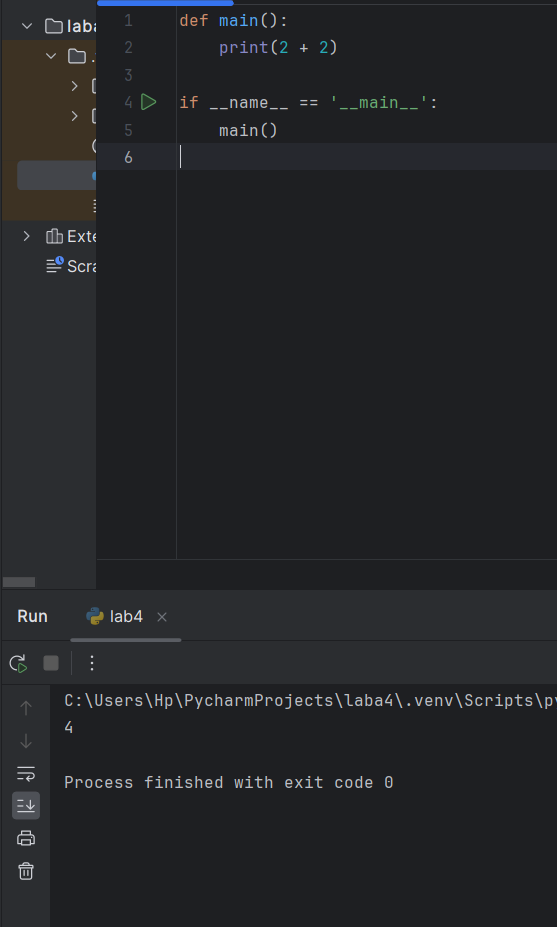

## Выводы
Программа определяет функцию main(), которая выполняет арифметическое действие (2 + 2) и выводит результат в консоль. “Точка входа” if __name__ == '__main__': гарантирует запуск функции только при прямом запуске файла.
## Лабораторная работа №2
### Напишите функцию, которая выполняет любые арифметические действия, возвращает при помощи return значение в место, откуда вызывали функцию. Выведите результат в консоль. Вызовите функцию используя точку входа.
```python
def main():
    result = 2 + 2
    return result

if __name__ == '__main__':
    answer = main()
    print(answer)

```
### Результат.
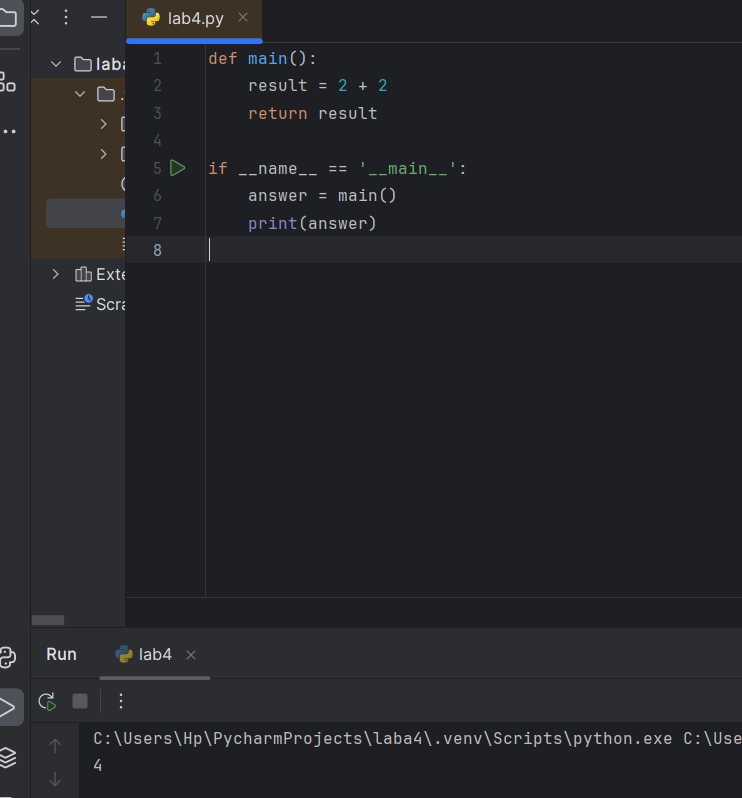
## Выводы
Функция возвращает результат арифметического действия, который сохраняется в переменную answer. Это позволяет использовать результат дальше без повторного вызова функции.

## Лабораторная работа №3
### Напишите функцию, в которую передаются два аргумента, над ними производится арифметическое действие, результат возвращается туда, откуда эту функцию вызывали. Выведите результат в консоль. Вызовите функцию в любом небольшом цикле. На скриншоте ниже приведен пример программы, в которой аргумент функции “x“превращается в параметр “one”, то же самое происходит с “y” и “two"
```python
def main(one, two):
    result = one + two
    return result

for i in range(5):
    x = 1
    y = 10
    answer = main(x, y)
    print(answer)

```
### Результат.
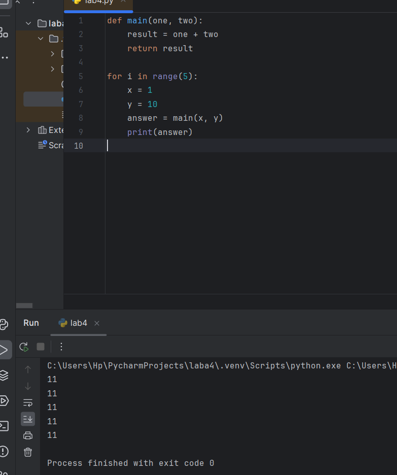
## Выводы
Функция возвращает результат арифметического действия, который сохраняется в переменную answer. Это позволяет использовать результат дальше без повторного вызова функции.

## Лабораторная работа №4
### Напишите функцию, на вход которой подается какое-то изначальное неизвестное количество аргументов, над которыми будет производится арифметические действия. Для выполнения задания необходимо использовать кортеж “*args”. На скриншоте ниже приведен пример такой программы с комментариями. Для закрепления понимания работы с кортежами настоятельно рекомендуем поменять аргументы вызова функции, вручную посчитать результат, только потом запустить программу с новыми значениями и проверить себя, насколько вы поняли данный аспект программирования
```python
def main(x, *args):
    one = x
    two = sum(args)
    three = float(one + two) / len(args)
    print(f"one={one}\ntwo={two}\nthree={three}")
    return x + sum(args) / float(len(args))

if __name__ == '__main__':
    print(main(1, 0, 2, -1, 0, -1, 1, 2))

```
### Результат.

## Выводы
Функция принимает любое количество аргументов, выводит промежуточные вычисления (one, two, three) и возвращает итоговое значение. Демонстрирует использование *args для обработки произвольного числа параметров.
## Лабораторная работа №5
### Напишите функцию, которая на вход получает кортеж “**kwargs” и при помощи цикла выводит значения, поступившие в функцию. На скриншоте ниже указаны два варианта вызова функции с “**kwargs” и два варианта работы с данными, поступившими в эту функцию. Комментарии в коде и теоретическая часть помогут вам разобраться в этом нелегком аспекте. Вызовите функцию используя “точку входа”
```python
def main(**kwargs):
    for i in kwargs.items():
        print(i[0], i[1])

    print()

    for key in kwargs:
        print(f"{key} = {kwargs[key]}")

if __name__ == '__main__':
    main(x1=[2, 3], y3=[3, 2], z0=[2, 0], q=[3, 0], w=[3, 0])
    print()
    main(**{'x': [1, 2, 3], 'y': [3, 3, 0]})

```
### Результат.


## Выводы
Функция принимает неограниченное количество именованных аргументов и выводит их с помощью цикла. Использование **kwargs превращает аргументы в словарь. Показаны два способа вызова — обычный и через передачу готового словаря.

## Лабораторная работа №6
### Напишите две функции. Первая – получает в виде параметра “**kwargs”. Вторая считает среднее арифметическое из значений первой функции. Вызовите первую функцию используя “точку входа” и минимум 4 аргумента.
```python
def main(**kwargs):
    # Функция работает с аргументами **kwargs
    for i, j in kwargs.items():
        print(f"{i}. Mean = {mean(j)}")

def mean(data):
    # Функция считает среднее арифметическое
    return sum(data) / float(len(data))

if __name__ == '__main__':
    main(x=[1, 2, 3], y=[3, 0])

```
### Результат.
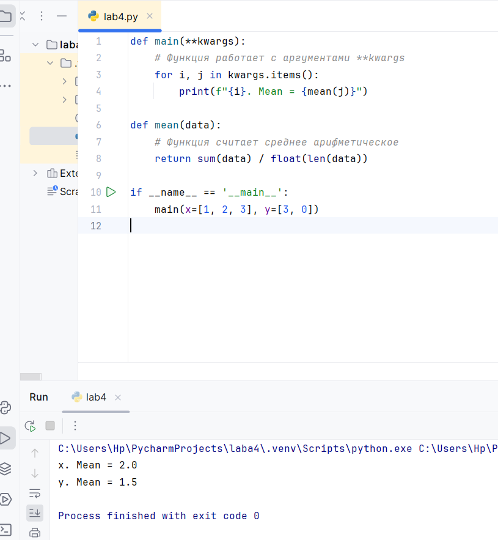
## Выводы
Первая функция main() принимает аргументы в виде **kwargs (именованные списки).
Вторая функция mean() вычисляет среднее арифметическое значений каждого списка.
Через “точку входа” программа вызывает main() и выводит средние значения для всех переданных списков.


## Лабораторная работа №7
### Создайте дополнительный файл .py. Напишите в нем любую функцию, которая будет что угодно выводить в консоль, но не вызывайте ее в нем. Откройте файл main.py, импортируйте в него функцию из нового файла и при помощи “точки входа” вызовите эту функцию.
```python
from for_import import say_hello

if __name__ == '__main__':
    say_hello()

```
### Результат.
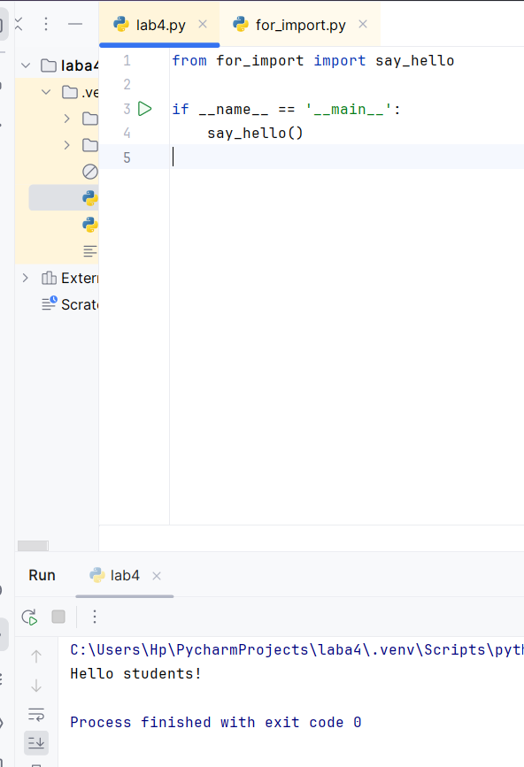
## Выводы
Эта программа импортирует функцию say_hello из модуля for_import и вызывает её. При запуске файла выполняется импортированная функция, которая выводит приветствие в консоль.

## Лабораторная работа №8
### Напишите программу, которая будет выводить корень, синус, косинус полученного от пользователя числа.
```python
from math import *

def main():
    value = int(input('Введите значение: '))
    print(sqrt(value))
    print(sin(value))
    print(cos(value))

if __name__ == '__main__':
    main()

```
### Результат.
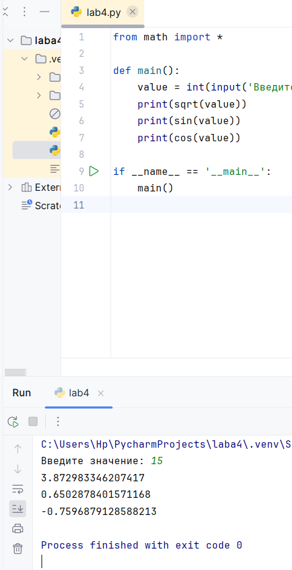
## Выводы
Программа запрашивает у пользователя число и выводит:квадратный корень, синус, косинус.


## Лабораторная работа №9
### Напишите программу, которая будет рассчитывать какой день недели будет через n-нное количество дней, которые укажет пользователь.
```python
from datetime import datetime as dt
from datetime import timedelta as td

def main():
    print(f"Сегодня {dt.today().date()}. "
          f"День недели – {dt.today().isoweekday()}")

    n = int(input('Введите количество дней: '))
    today = dt.today()
    result = today + td(days=n)
    print(f"Через {n} дней будет {result.date()}. "
          f"День недели – {result.isoweekday()}")

if __name__ == '__main__':
    main()

```
### Результат.
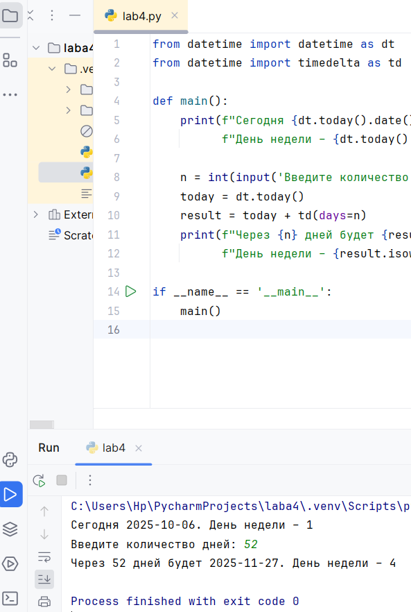
## Выводы
Программа показывает текущую дату и день недели.
Затем пользователь вводит количество дней, и программа вычисляет, какая дата и день недели будут через указанное количество дней.
Используются модули datetime и timedelta для работы с датами и временем.

## Лабораторная работа №10
### Напишите программу с использованием глобальных переменных, которая будет считать площадь треугольника или прямоугольника в зависимости от того, что выберет пользователь. Получение всей необходимой информации реализовать через input(), а подсчет площадей выполнить при помощи функций. Результатом программы будет число равное площади необходимой фигуры
```python
global result

def rectangle():
    a = float(input("Ширина: "))
    b = float(input("Высота: "))
    global result
    result = a * b

def triangle():
    a = float(input("Основание: "))
    h = float(input("Высота: "))
    global result
    result = 0.5 * a * h

figure = input("1 - прямоугольник, 2 - треугольник: ")

if figure == '1':
    rectangle()
elif figure == '2':
    triangle()

print(f"Площадь: {result}")

```
### Результат.
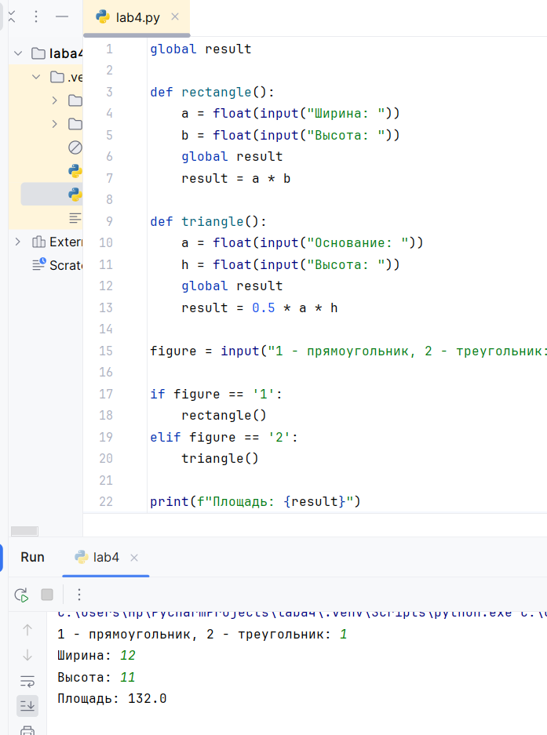
## Выводы
Программа вычисляет площадь прямоугольника или треугольника в зависимости от выбора пользователя и выводит результат на экран.
## Самостоятельная работа №1
### Дайте подробный комментарий для кода, написанного ниже. Комментарий нужен для каждой строчки кода, нужно описать что она делает. Не забудьте, что функции комментируются по-особенному.
```python
from datetime import datetime  # Импортируем модуль для работы с датой и временем
from math import sqrt  # Импортируем функцию sqrt для вычисления квадратного корня

def main(**kwargs):  # Определяем функцию, которая принимает именованные аргументы
    for key in kwargs.items():  # Проходим по всем переданным парам ключ-значение
        result = sqrt(key[1][0] ** 2 + key[1][1] ** 2)  # Вычисляем длину вектора (по теореме Пифагора)
        print(result)  # Выводим результат

if __name__ == '__main__':  # Проверяем, что код выполняется напрямую
    start_time = datetime.now()  # Сохраняем текущее время (момент начала)
    main(  # Вызываем функцию main с несколькими аргументами
        one=[10, 3],
        two=[5, 4],
        three=[15, 13],
        four=[93, 53],
        five=[133, 15]
    )
    time_costs = datetime.now() - start_time  # Считаем, сколько времени заняло выполнение
    print(f"Время выполнения программы - {time_costs}")  # Выводим время выполнения


```

## Выводы
Программа вычисляет длину вектора для нескольких пар чисел, используя теорему Пифагора. После этого она выводит все длины и показывает, сколько времени заняло выполнение программы.+

## Самостоятельная работа №2
### Напишите программу, которая будет заменять игральную кость с 6 гранями. Если значение равно 5 или 6, то в консоль выводится «Вы победили», если значения 3 или 4, то вы рекурсивно должны вызвать эту же функцию, если значение 1 или 2, то в консоль выводится «Вы проиграли». При этом каждый вызов функции необходимо выводить в консоль значение “кубика”. Для выполнения задания необходимо использовать стандартную библиотеку random. Программу нужно написать, используя одну функцию и “точку входа
```python
import random

def dice():
    roll = random.randint(1, 6)
    print(f"Выпало: {roll}")
    if roll in [5, 6]:
        print("Вы победили")
    elif roll in [3, 4]:
        dice()
    else:
        print("Вы проиграли")

if __name__ == "__main__":
    dice()

```
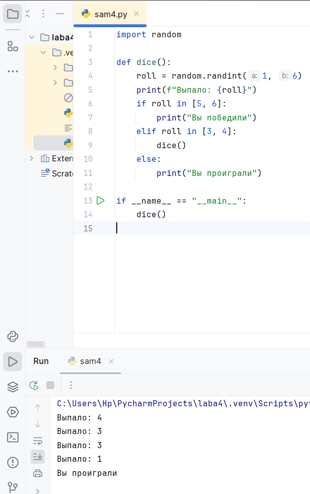
## Выводы
Программа имитирует бросок шестигранного кубика. Если выпадает 5 или 6 — вы выигрываете. Если 3 или 4 — бросок повторяется. Если 1 или 2 — вы проигрываете. Каждый результат сразу показывается в консоли. Используется рекурсия, то есть функция вызывает саму себя, пока не будет победа или проигрыш.

## Самостоятельная работа №3
### Напишите программу, которая будет выводить текущее время, с точностью до секунд на протяжении 5 секунд. Программу нужно написать с использованием цикла. Подсказка: необходимо использовать модуль datetime и time, а также вам необходимо как-то “усыплять” программу на 1 секунду.
```python
from datetime import datetime
import time

for i in range(5):
    print(datetime.now().strftime("%H:%M:%S"))
    time.sleep(1)

```
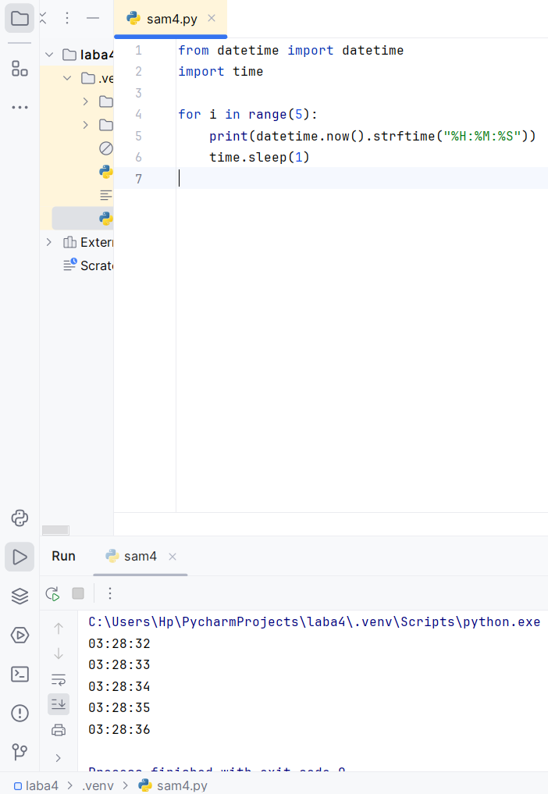
## Выводы
Программа в течение пяти секунд каждую секунду выводит текущее время. Используется цикл for и функция time.sleep(1), которая “усыпляет” выполнение программы на одну секунду, чтобы вывод был равномерным.
## Самостоятельная работа №4
### Напишите программу, которая считает среднее арифметическое от аргументов вызываемое функции, с условием того, что изначальное количество этих аргументов неизвестно. Программу необходимо реализовать используя одну функцию и “точку входа"
```python
def calculate_average(*args):
    if len(args) == 0:
        return 0

    total_sum = sum(args)
    average = total_sum / len(args)
    return average

if __name__ == '__main__':
    result1 = calculate_average(10, 20, 30)
    print(f"Среднее арифметическое (10, 20, 30) = {result1}")
    result2 = calculate_average(1, 2, 3, 4, 5)
    print(f"Среднее арифметическое (1, 2, 3, 4, 5) = {result2}")
    result3 = calculate_average(15)
    print(f"Среднее арифметическое (15) = {result3}")
    result4 = calculate_average()
    print(f"Среднее арифметическое () = {result4}")

```
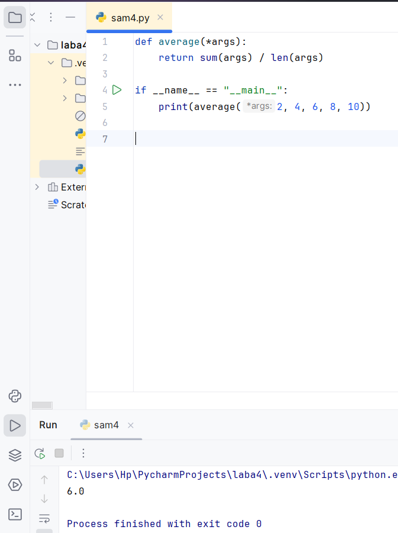
## Выводы
Эта программа вычисляет среднее арифметическое произвольного количества чисел. Функция принимает любое число аргументов, суммирует их и делит на количество, возвращая среднее значение. Программа демонстрирует работу функции на разных наборах чисел: от трех значений до пустого вызова, в последнем случае возвращая 0.
## Самостоятельная работа №5
### Эта программа вычисляет среднее арифметическое произвольного количества чисел. Функция принимает любое число аргументов, суммирует их и делит на количество, возвращая среднее значение. Программа демонстрирует работу функции на разных наборах чисел: от трех значений до пустого вызова, в последнем случае возвращая 0.
```python
from triangle import triangle_area

a = float(input("Сторона a: "))
b = float(input("Сторона b: "))
c = float(input("Сторона c: "))

area = triangle_area(a, b, c)
print(f"Площадь треугольника: {area}")

triangle.py
import math

def triangle_area(a, b, c):
    p = (a + b + c) / 2
    return math.sqrt(p * (p - a) * (p - b) * (p - c))
```
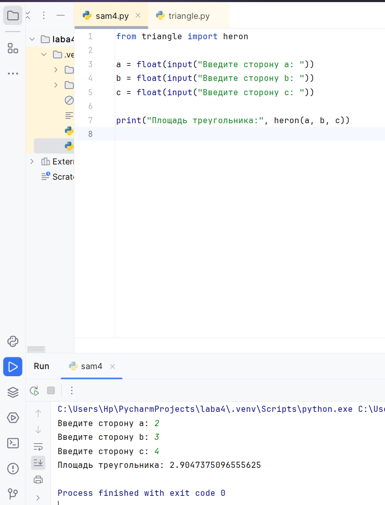
.png)
## Выводы
Эта программа состоит из двух файлов. Первый (triangle.py) содержит функцию, которая вычисляет площадь треугольника по формуле Герона. Второй файл (main.py) взаимодействует с пользователем: запрашивает длины сторон треугольника и выводит готовый результат. Такой подход показывает, как можно разделять код на модули — вычисления отдельно, а пользовательский ввод отдельно.
## Общие выводы по теме
**Функции:** 
- Разбивают код на логические блоки
- Принимают разные типы аргументов (*args, **kwargs)
- Могут возвращать значения и вызывать себя рекурсивно
- Требуют правильного документирования

**Стандартные модули:**
- math - математические операции
- datetime/time - работа со временем  
- random - случайные числа
- Собственные модули для разделения кода

**Архитектура:**
- Разделение логики и интерфейса
- Точка входа для контроля выполнения
- Обработка ошибок и граничных случаев
- Измерение производительности

Освоение этих элементов позволяет создавать структурированные и эффективные программы.
